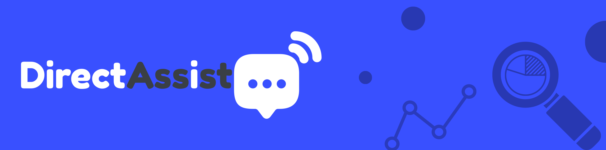

<!-- Banner -->

<!-- Header Name -->

# 🎓 Fɪɴᴀʟ Rᴇsᴇᴀʀᴄʜ Rᴇᴘᴏʀᴛ & Pʀᴇsᴇɴᴛᴀᴛɪᴏɴ

_Comprehensive Insights into SEO Improvements_

---

## 📄 Assignment Instructions

### Final Research Report and Presentation

### Submission Requirements

Students are required to submit the following deliverables as part of their final assessment:

1. **Research Report**: A comprehensive document in PDF format that explores the findings, analyses, and insights related to the project. This report must be printed and professionally bound with a transparent cover and binding slider. It should include branding, an index, an introduction, and a conclusion. The document should detail metrics, their significance, performance evaluations, and proposed strategies for further SEO improvements.

2. **Presentation Recording**: A video recording of your presentation summarizing the content of the research report. This presentation should be delivered in a professional manner, featuring well-designed slides with relevant infographics and direct screenshots of metrics from tools such as Google Analytics (GA), Google Search Console (GSC), and Google Ads (GAW).

### Presentation should include:

- An introduction outlining your role in the SEO project.
- Explanations of your metrics, their correlations, and discovered patterns.
- Additional SEO efforts, such as host selection, CDN usage, and demographic analysis.

### Key Points to Remember:

- The presentation should be clear, concise, and visually engaging.
- Ensure both files reflect the same findings, with the report offering more in-depth explanations.
- Provide actionable insights for future SEO enhancements.

---

### Submission Format:

- The research report (PDF) and the video presentation should be packaged in a single zipped folder.
- Submit the zipped folder by **8 November 2024 at 23:30 hrs**.
- Ensure that your submission is professional and aligns with real-world industry standards, showcasing your ability to communicate project success and strategies effectively.

---

<!-- Contact Section -->

## 🤝 Cᴏɴɴᴇᴄᴛ Wɪᴛʜ Mᴇ 🤝

  
  
  
  
  
  

 

<!-- Footer -->

  

