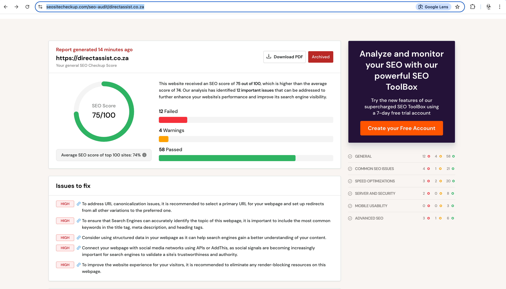
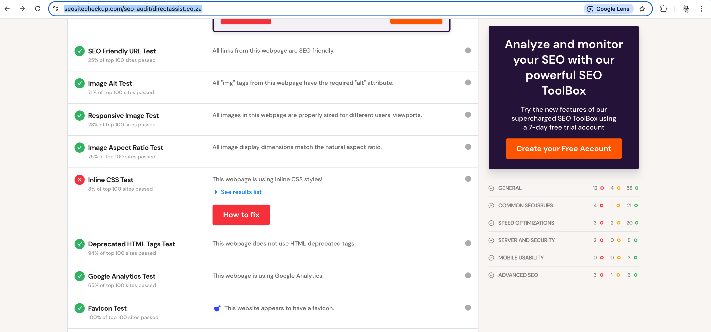
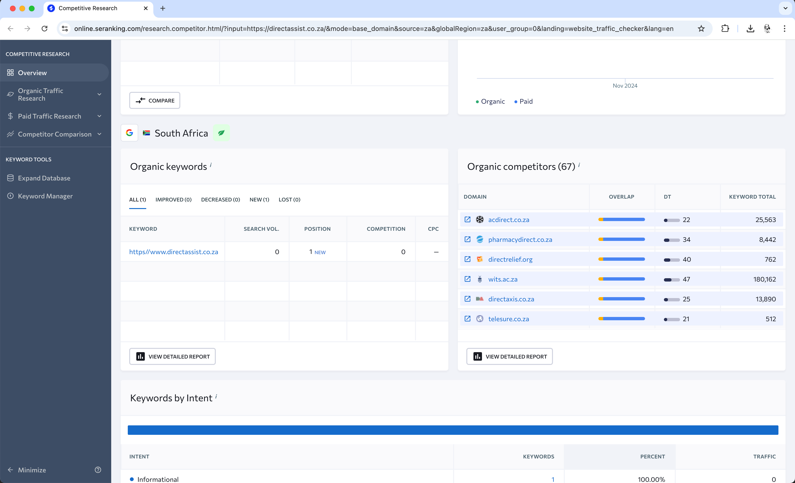
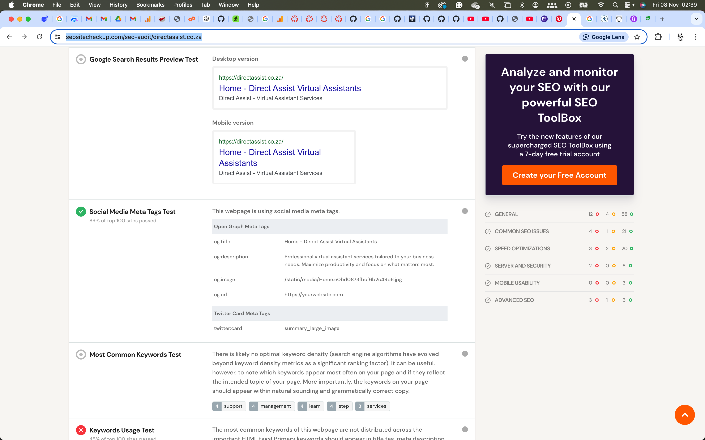

<!-- Banner -->

# 🎓 Final Research Report: SEO Performance Evaluation of Direct Assist

**By:** Tebogo Ramolobeng  
**Student Number:** 221244  
**Subject:** Theory Development 200  
**Date:** 08 November 2024  
**Lecturer(s):** Tsungai Katsuro

## Table of Contents

1. [Introduction](#introduction)
2. [Project Overview](#project-overview)
3. [Methodology](#methodology)
4. [Findings](#findings)
   - [SEO Score Overview](#seo-score-overview)
   - [Identified Issues](#identified-issues)
   - [Performance Metrics](#performance-metrics)
5. [Analysis of Metrics](#analysis-of-metrics)
6. [Proposed Strategies for SEO Improvements](#proposed-strategies-for-seo-improvements)
7. [Conclusion](#conclusion)
8. [References](#references)

## Introduction

In the digital age, a robust online presence is vital for any business. This report evaluates the SEO performance of the website Direct Assist using various analytical tools. The objective is to identify strengths and weaknesses in the current SEO strategies and propose actionable improvements. This document serves as a comprehensive guide for enhancing search engine visibility, ultimately aiding in the business’s growth.

## Project Overview

Direct Assist is a virtual assistant service that aims to streamline business operations by offering various support services, including administrative assistance, customer service, and project management. As part of the project, I analyzed the website's SEO performance to enhance its visibility and effectiveness in attracting potential clients.

## Methodology

The evaluation process involved using the SEO Site Checkup tool, which provided insights into the website's SEO score, identified issues, and offered recommendations for improvements. Data was collected from October 11 to November 7 to assess trends and changes over time. The primary metrics evaluated included:

- SEO Score
- Page Load Speed
- Keyword Usage
- Meta Tags and Descriptions
- Content Quality

## Findings

### SEO Score Overview

The website received an SEO score of 75 out of 100, which is above the average score of 74% for top-performing sites. This indicates that while the site has a good foundation, there are areas that require improvement to enhance visibility and user experience.

### Identified Issues

The analysis highlighted 12 major issues impacting the website's performance:

- **Canonicalization Issues:** The need for a primary URL to avoid duplicate content.
- **Keyword Optimization:** Common keywords were not effectively utilized in title tags and headings.
- **Structured Data:** Absence of structured data to help search engines better understand the content.
- **Social Media Integration:** Lack of connections to social media platforms.
- **Render-Blocking Resources:** Identified resources that hindered page load speeds.
- **Image Optimization:** Recommendation to use modern image formats to reduce file sizes.
- **Custom 404 Error Page:** Suggestion to create a user-friendly error page to retain visitors.
- **Sitemap Absence:** A sitemap is essential for search engines to index the website properly.
- **Caching Headers:** Recommendations to improve loading speeds for returning users.
- **Inline CSS Styles:** Suggestion to move inline styles to external stylesheets for better performance.
- **Security Enhancements:** Recommendations to implement the Strict-Transport-Security header.

### Performance Metrics

- **Loading Speed:** The website's loading time is approximately 1.81 seconds, which is under the recommended 5 seconds.
- **Time to First Byte:** Recorded at 0.219 seconds, well within the acceptable range.
- **First Contentful Paint:** The value is 2.052 seconds, indicating room for improvement.

## Analysis of Metrics

The metrics suggest that while the website performs reasonably well, improvements can significantly enhance user experience and search engine rankings. The presence of high-quality content, effective keyword usage, and optimized media files are crucial for improving visibility. The identified issues must be addressed to align with best practices in SEO.

## Proposed Strategies for SEO Improvements

Based on the findings, the following strategies are recommended:

1. **Implement Canonical Tags:** Define a preferred URL for pages to prevent duplicate content issues.
2. **Optimize Keywords:** Revise title tags, meta descriptions, and headers to include relevant keywords reflecting the site's focus.
3. **Utilize Structured Data:** Implement JSON-LD structured data to enhance search engine understanding of site content.
4. **Integrate Social Media:** Use social media APIs to enhance visibility and engagement.
5. **Eliminate Render-Blocking Resources:** Optimize scripts and styles to improve loading times.
6. **Adopt Modern Image Formats:** Convert images to formats like WebP for better loading speeds.
7. **Create a Custom 404 Page:** Design an error page that retains visitors with helpful links.
8. **Add a Sitemap:** Create and submit a sitemap to improve indexing efficiency.
9. **Implement Caching Headers:** Improve user experience for repeat visitors with effective caching strategies.
10. **Enhance Security Features:** Include the Strict-Transport-Security header to secure the website against potential threats.

## Conclusion

The SEO evaluation of the Direct Assist website has provided valuable insights into its performance and areas for improvement. By addressing the identified issues and implementing the proposed strategies, the website can enhance its search engine visibility, improve user experience, and ultimately drive more traffic and conversions. This report serves as a foundational document for ongoing SEO efforts, guiding future enhancements.

## References

- SEO Site Checkup. (2024). Retrieved from [SEO Site Checkup](https://seositecheckup.com/seo-audit/directassist.co.za)
- Google Analytics. (2024). Retrieved from [Google Analytics](https://analytics.google.com/)
- Google Search Console. (2024). Retrieved from [Google Search Console](https://search.google.com/search-console)

---

### Links to Submission Materials

- [Research Document](https://drive.google.com/file/d/1sbRnhWOostmHER-eMfxpBDeUIbWspV6B/view?usp=drive_link)
- [Presentation Recording](https://drive.google.com/file/d/19EpbS-RQ_9xcEkgTj2wQm8paRhwsSyjZ/view?usp=drive_link)

